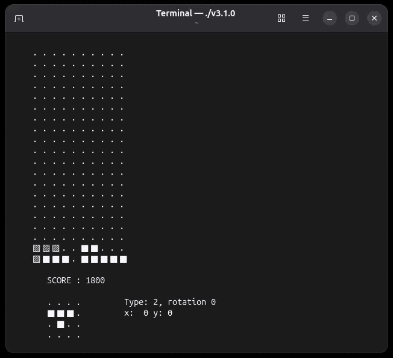

# Tetris Agent

A fast, lightweight **Tetris implementation** written in C with several heuristic algorithms and performance analysis tools. 
Built as a TIPE project for the 2026 French MPI engineering entrance exams.



## Features

This project implements a Tetris game engine in C along with several agents that can play the game autonomously. It includes:

- A simple CLI to handle algorithms
- Several evaluation heuristics (simple, random, linear)
- Depth-limited search with averaging
- Optimizations using next-piece prediction to significantly reduce computation time
- A robust analysis module to benchmark algorithm performance over thousands of games


## Building

### Prerequisites
- GCC and Make

### Compilation
- Compilation : ```make```
- Execution : ```./exec```
